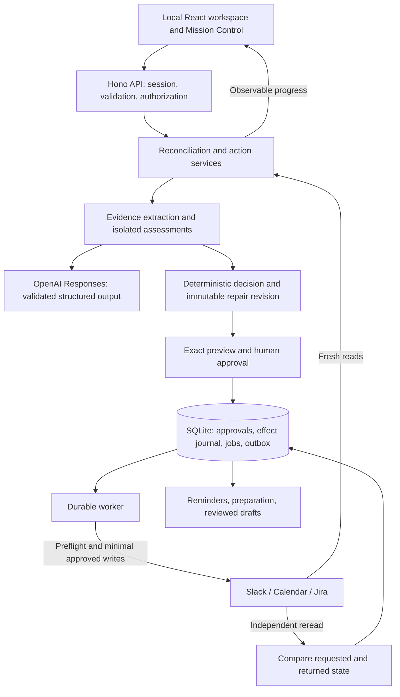

# Reality Sync · ATLAS

**When a decision changes in Slack, the rest of your tools should not keep living in the past.**

Reality Sync is a local application that detects conflicting project facts across **Slack, Google Calendar, and Jira**, investigates their evidence, previews an exact repair, waits for approval, applies the changes, and independently reads the results back. Reminders, preparation work, and reviewed communications can then adapt to the verified decision.

**Detect → Investigate → Reconcile → Approve → Act → Verify → Adapt**

## For hackathon judges

- **Public source:** [aromano3141/ATLAS](https://github.com/aromano3141/ATLAS). No repository invitation is required.
- **Two-minute demo video:** [Watch Reality Sync in action on YouTube](https://youtu.be/AIgFjlDRNXs).
- **Interactive walkthrough:** run the app below, then choose **Demo Mission Control** in its sidebar. Demo Replay needs no provider credentials.
- **Technical evidence:** [validation record](docs/VALIDATION.md), [test suite](tests), [master plan](docs/PLAN.md), and [presentation guide](docs/MISSION_CONTROL.md).

The source repository is public; the running application, credentials, and real workspace evidence remain local. The localhost links below work after starting the application on your computer. They are not a remotely hosted demo.

## The problem and the launch story

A project date is often repeated in several applications. A decision owner changes it in a conversation, while the calendar event and release record remain stale. A notification alone leaves the operator to reconstruct the decision, decide whose statement counts, update each system, and check whether the changes actually stuck.

Reality Sync brings that work into one reviewable workflow. The flagship presentation follows **Atlas Demo Launch**, initially scheduled for **September 30, 2026**, with a requested replacement date of **October 2, 2026**. Calendar and Jira each get their own change preview, operation status, and readback result.

There are three distinct ways to explore the implementation:

| Path                                               | Decision source                                             | What actually happens                                                                                                                       |
| -------------------------------------------------- | ----------------------------------------------------------- | ------------------------------------------------------------------------------------------------------------------------------------------- |
| **Demo Replay** in Mission Control                 | Scripted launch evidence and structured assessment fixtures | A complete paced presentation, including approval and optional recovery. Operations are simulated; no external reads, writes, or messages.  |
| **Evidence-driven reconciliation**                 | Fresh provider evidence and validated model assessments     | The backend evaluates actual sources, proposes a repair or abstains, then executes only an approved revision. Live failures remain visible. |
| **Current Atlas date-repair card** in the main app | Explicit operator instruction to use October 2              | Fresh Calendar/Jira reads, an exact preview, and a button that approves and queues real changes. Agents are UI-only for this path.          |

The Atlas shortcut deliberately does not invent a Slack decision or claim model approval. Its operator instruction persists for subsequent scans of that entity. Other entities retain the evidence-driven engine. Demo Replay illustrates the owner-reply narrative; live evidence is never assumed to contain that reply.

## Run locally

Requires **Node.js 24 or later**, npm, and Git. No provider account is needed to explore Demo Replay or the fixture workspace.

```powershell
git clone https://github.com/aromano3141/ATLAS.git
cd ATLAS
npm install
npm --prefix web run install:ci
npm run setup
npm run dev
```

Open [Reality Sync](http://localhost:5173), then **Demo Mission Control**, or visit [the local walkthrough](http://localhost:5173/mission-control).

1. Select **Demo Replay** and press **Play walkthrough**.
2. Watch sources arrive, the agents build the timeline, and the proposed repair appear.
3. At the approval gate, press **Approve replay repair**. Playback cannot skip approval.
4. Watch Calendar and Jira progress separately through execution and verification.
5. Optionally enable the **Recovery branch** to demonstrate a lost write response followed by reread and recovery.

Presentation layout, full screen, presenter notes, Play/Pause, Next, and Reset support a short judge presentation. Expand the technical inspector to see source references, structured assessments, revisions, approval binding, operations, and events.

For backend exploration without accounts, select **Fixture workspace** in the main app and **Scan now**. It uses deterministic provider fixtures and a separate database. This exercises backend reconciliation and execution code; the browser-only replay instead prioritizes repeatable presentation pacing.

## External apps and services

| Integration                     | Reads                                                                                   | Approved effects                                                                      | Implementation                                                              |
| ------------------------------- | --------------------------------------------------------------------------------------- | ------------------------------------------------------------------------------------- | --------------------------------------------------------------------------- |
| **Slack**                       | Configured channel threads, authors, timestamps, clarification replies, identity checks | Reviewed messages, personal scheduled reminders, interactive review controls          | Web API adapter; Bolt Socket Mode for local interactions                    |
| **Google Calendar**             | Events and occurrences, dates/times/locations, effective reminders, availability        | Targeted event repairs, reminder settings, personal preparation blocks                | OAuth-backed Calendar adapter; conditional updates and independent rereads  |
| **Jira Cloud**                  | Release versions; explicitly linked issue status, description, deadline, and comments   | Release-date corrections and reviewed comments                                        | Tenant REST adapter; immediate preflight and readback                       |
| **OpenAI** — supporting service | Selected evidence supplied by the backend                                               | Structured extraction, assessments, and language drafts; no direct provider execution | Configurable Responses API model, schema validation, recorded usage/latency |

Slack, Calendar, and Jira are the three business applications. GitHub hosts the public source. **Maps and navigation were removed** and require no credentials. No email integration is used for unmapped external attendees.

## Architecture

The application uses **TypeScript throughout**, a **React 19 / Vinext / Vite** interface, **Tailwind CSS and existing component primitives**, a **Node.js 24 / Hono** backend, and **native SQLite** persistence. Zod validates configuration and structured contracts; Temporal utilities handle time and occurrence semantics.



The diagram describes the evidence-driven path. The operator-directed Atlas path enters at an explicit instruction and repair preview, bypassing model investigation. Demo Replay stays in the browser.

### Evidence and independent assessments

The engine preserves original evidence and provenance rather than presenting a generated answer as a source. Structured claims refer to source IDs and supporting quotes. Entity identity, author identity, timestamps, authority configuration, and explicit supersession determine whether a statement can support a repair.

Three assessment roles examine the evidence:

- **Temporal:** distinguishes the original date, later proposals, explicit replacements, and applicable date/time semantics.
- **Authority:** checks actual author IDs against configured decision owners. A message calling itself authoritative does not grant its author permission.
- **Skeptic:** looks for ambiguity, conflicting authority, unsupported interpretation, and reasons to abstain.

These are isolated assessments using the **same configurable model and shared retrieved evidence**. Initial assessments commit before seeing peer conclusions. The engine permits one bounded follow-up round, then deterministically resolves or abstains. This is not a claim of different models, independent retrieval, or hidden-state collaboration.

The blackboard shows concise structured conclusions, supporting references, disagreements, and rationale. Confidence is a model-reported assessment signal, not a calibrated accuracy guarantee. Private chain-of-thought is neither required nor displayed. Low confidence, conflicting authority, ambiguous entities, or insufficient support can prevent a repair.

### Exact patches and revision-bound approval

For the launch example, the requested changes are:

| Resource field             | Baseline     | Requested    |
| -------------------------- | ------------ | ------------ |
| Calendar `start.date`      | `2026-09-30` | `2026-10-02` |
| Calendar `end.date`        | `2026-10-01` | `2026-10-03` |
| Jira version `releaseDate` | `2026-09-30` | `2026-10-02` |

**All-day Calendar end dates are exclusive.** October 3 is therefore the end boundary of an October 2 all-day milestone. The repair preserves the event title, all-day representation, conference information, and unrelated fields. Jira retains the version name and unreleased status.

The backend binds approval to a particular immutable plan revision and its source/target snapshot. An approval is not reusable permission to apply a later plan. Resource allowlists, current configuration, source state, and target preconditions are checked before execution. The direct Atlas button — **Change Calendar & Jira to October 2** — is the explicit approval for its displayed revision, not a bypass around the executor.

### Execution, partial results, and recovery

Every provider mutation is tracked in a durable effect journal. The executor records intent before attempting the external request, applies a minimal patch, and independently rereads the resource. A successful HTTP response alone does not earn a verified badge.

Calendar uses its ETag for conditional updates. Jira is reread immediately before updating its version. This reduces stale writes but does **not** create an atomic cross-provider transaction or Jira compare-and-swap guarantee.

If Calendar succeeds and Jira fails, the UI keeps Calendar's verified result and exposes the remaining failure. If a request times out after the provider may have applied it, the effect remains uncertain until inspection establishes the outcome. Recovery rereads the resource and avoids repeating an already-applied repair. An unresolved message send is not blindly retried.

SQLite stores jobs, approvals, effects, and dependency updates independently of browser sessions. Numbered migrations, prepared SQL, WAL mode, worker leases, and a transactional outbox support restart recovery. Revision checks prevent a stale worker from treating a superseded plan as current. This is recovery through durable state and verification, not a blanket exactly-once delivery claim.

### Observable Mission Control

Mission Control is part of the main app, with shared presentation components for Replay and Live. The central blackboard, source panels, agent panels, animated connections, and growing timeline expose the relationship between evidence and conclusions.

Live mode uses backend state and a server-sent event stream. Assessment milestones, approval state, operation progress, and verification values come from the backend. Cached results are identified as reused. There is no silent fallback to Replay when credentials fail or a scan disagrees with the expected story.

Technical details expose resource references, plan revisions, structured results, operation receipts, and requested-versus-returned dates. A verified badge requires the appropriate approved plan and a matching verified result. For the operator-directed Atlas path, agent panels explicitly remain presentation-only.

## Adapt after verification

Dependent features use the shared event revision rather than selecting their own competing version of reality. Verified changes enqueue dependency updates; superseded drafts and dependent state can be invalidated or recomputed.

### Smart reminders and preparation

- Event-relative reminders bind to a selected occurrence and follow its verified time. Absolute reminders preserve the requested time and can be flagged when circumstances change.
- Native Calendar offsets are preserved; the app verifies effective defaults/overrides instead of creating a duplicate alert just because an event moved. Reminder-only changes are not detected solely through the event's `updated` timestamp.
- Recurring identity includes the series and original occurrence start, so rescheduling does not silently turn a reminder into one for another occurrence.
- Logical reminder ownership, occurrence, purpose, and channel prevent accumulating equivalent schedules.
- Explicit Calendar–Jira preparation links surface unfinished work. Personal preparation blocks check availability and default to 30 minutes. A meeting change does not edit the linked issue's status or deadline.
- Slack schedules retain provider IDs. Replacement reconciles the existing schedule and confirms cancellation first; the 120-day horizon and 60-second cancellation cutoff are handled explicitly. Scheduled-message metadata is not used.
- On restart, missed local alerts become an inbox summary rather than a burst of obsolete notifications. Previously scheduled provider notifications can operate while the backend is off, but new changes cannot propagate until it reconnects.

The UI reports notification **configuration and schedule state**, not guaranteed device alerts. Preparation creation requires review under the default preferences.

### Reviewed messages and clarification

Clarification, correction-update, and consequence drafts show exact text, destination, supporting facts, and verification state. Edits create a new revision; stale facts invalidate prior send approval. Partial success produces partial-success wording.

Audience checks are separate from repair approval. Slack identity mappings are verified; private-source boundaries and Jira redistribution rules are enforced. Jira comment visibility restrictions are preserved. Unmapped or external attendees do not silently become a partially notified group.

Clarification replies retain actual author identity and timestamps and can reopen reconciliation. A reply is new evidence, not permission to execute a repair. Slack Socket Mode buttons validate the acting user and current revision through the same backend services used by the UI. Message presence can be verified; human readership cannot.

## Connect real demo resources

Follow the detailed [setup guide](docs/SETUP.md). The following is the configuration sequence used by this architecture:

1. Run `npm run setup`. It creates validated local configuration and a blank credential template without replacing an existing secrets file.
2. Open **Connections** and configure dedicated resource bindings, decision-owner IDs, approver IDs, allowlists, and sharing rules. [config.example.json](config.example.json) documents the structure using placeholders.
3. Configure a Slack app using [slack-manifest.json](slack-manifest.json), install it, and invite it to the selected channel. Thread timestamps must remain strings. Channel replies may require the dedicated operator's user token; writes use the bot token. Socket Mode additionally uses an app-level token.
4. Configure Google Calendar OAuth with a client ID, client secret, and refresh token for the dedicated demo user. Bind the actual calendar and event IDs; use an all-day milestone for the launch scenario.
5. Configure the Jira tenant URL, operator email, API token, project ID, and release version ID. The account must have the relevant read and version-edit permissions. Linked preparation issues and comment permissions are separate configuration.
6. For evidence-driven investigation, configure an OpenAI project key and a Responses Structured Outputs model accessible to that project. The model is editable in Connections; the app does not silently substitute a different model or fixture result.
7. Restart the backend after changing credentials, run connection checks, and use the read-only diagnostic below before approving any live action.

The generated `secrets.env` contains these names, with values supplied locally:

```dotenv
OPENAI_API_KEY=
SLACK_BOT_TOKEN=
SLACK_APP_TOKEN=
SLACK_USER_TOKEN=
GOOGLE_CLIENT_ID=
GOOGLE_CLIENT_SECRET=
GOOGLE_REFRESH_TOKEN=
JIRA_API_TOKEN=
```

**Credential presence is not a successful connection check.** Provider authentication, resource access, and a successful scan are separate observations. The operator-directed Atlas repair bypasses Slack and OpenAI investigation, but still requires working Calendar/Jira access and valid resource configuration.

The default Windows data directory is `%LOCALAPPDATA%\RealitySync`; elsewhere it falls back to `~/.local/share/RealitySync`. Setup and Connections show the actual location. `REALITY_SYNC_DATA_DIR` can select a different local directory. Keep it outside OneDrive and outside the repository. Existing installations should preserve their configuration and database rather than copying a template over them.

## How we tested reliability

The latest recorded implementation checkpoint has **49 passing deterministic tests**, passing frontend/backend TypeScript checks, and a successful production build. The [validation record](docs/VALIDATION.md) separates earlier checkpoints, browser checks, read-only provider checks, and remaining live acceptance.

| Failure or edge case                                                                    | Protection exercised                                                                                  | Test source                                                                                        |
| --------------------------------------------------------------------------------------- | ----------------------------------------------------------------------------------------------------- | -------------------------------------------------------------------------------------------------- |
| Newer suggestion mistaken for an approved decision; conflicting owners; weak evidence   | Authority, supersession, confidence, and abstention checks; independent assessment behavior           | [reality.test.ts](tests/reality.test.ts)                                                           |
| Concurrent changes or stale approval                                                    | Snapshot/revision checks, Calendar preconditions, target preflight                                    | [reality.test.ts](tests/reality.test.ts), [operator-launch.test.ts](tests/operator-launch.test.ts) |
| Successful Calendar write followed by timeout; Jira failure                             | Durable journal, readback recovery, retained partial success, no repeated completed Calendar write    | [reality.test.ts](tests/reality.test.ts), [operator-launch.test.ts](tests/operator-launch.test.ts) |
| All-day repair changes unrelated fields                                                 | Exact start/end/release-date assertions and preservation checks                                       | [operator-launch.test.ts](tests/operator-launch.test.ts)                                           |
| Timezone/DST, recurring occurrence, canceled/declined/virtual event                     | Time and event-identity contracts                                                                     | [reality.test.ts](tests/reality.test.ts)                                                           |
| Duplicate reminders, schedule replacement, cutoff, missed alerts, completed preparation | Logical ownership, provider schedule reconciliation, timing and lifecycle checks                      | [reality.test.ts](tests/reality.test.ts), [adapt-contracts.test.ts](tests/adapt-contracts.test.ts) |
| Restricted audience, stale draft, unauthorized actor, ambiguous send                    | Disclosure/approval checks and uncertain-send recovery                                                | [reality.test.ts](tests/reality.test.ts), [adapt-contracts.test.ts](tests/adapt-contracts.test.ts) |
| Slack `invalid_arguments` and timestamp corruption                                      | GET query encoding, POST preservation, precise string timestamps, pagination                          | [slack-transport.test.ts](tests/slack-transport.test.ts)                                           |
| Replay skips approval or shows unsupported success                                      | Replay boundaries, assessment commit barrier, approval/readback badge conditions, read-only isolation | [mission.test.ts](tests/mission.test.ts)                                                           |

Reproduce the automated checks:

```powershell
npm run check
npm test
npm run build
npm run demo:recovery
```

The recovery command uses a fixture database and two separate processes: a Calendar mutation followed by a lost response, then reopening the journal, rereading Calendar, and performing only the remaining Jira mutation.

With the app running:

```powershell
npm run test:http
npm run live:check
npm run scan:read-only -- --entity YOUR_ENTITY_ID
```

`live:check` is read-only and returns nonzero when configuration is not ready. `scan:read-only` compares the running app's actual configuration with disk configuration, uses an isolated in-memory journal, blocks provider writes, and never starts an execution worker. Diagnostic reports stay in the local data directory.

This diagnostic also caught an actual integration issue: Slack thread reads were sending parameters in the wrong place for GET requests. The adapter now encodes query parameters and preserves the thread timestamp as a string. A Windows data-directory discrepancy was resolved without overwriting the original configuration. See the [recorded diagnosis](docs/VALIDATION.md).

### What has and has not been demonstrated live

**Recorded:** real Slack, Calendar, Jira, and OpenAI passed a read-only launch scan. Mission Control's full replay and recovery branch were exercised in the browser. Live mode displayed actual backend state. The main Atlas card displayed fresh September 30 dates, October 2 repair previews, and its enabled approval button.

**Still pending live acceptance:** approved Calendar/Jira writes and their rereads, a real successful-write timeout/recovery, reminder and preparation effects, reviewed Slack/Jira sends, and actual Socket Mode interactions. The development browser check did not click the live write button. Fixture success is not represented as proof of live provider mutation or delivery.

## Security, deployment, and boundaries

- The Hono API binds to `127.0.0.1:4318`; the local UI uses same-origin API requests. Local session cookies and CSRF checks protect application actions. This is a single-operator localhost prototype, not a hosted multi-user service.
- Provider credentials stay in the backend's local secrets file. Real evidence, databases, tokens, and generated output are excluded from Git. Local storage is not described as an encrypted vault.
- Evidence-driven model calls transmit the selected evidence to the configured OpenAI service. Local application hosting does not mean inference is offline.
- Decisions, repairs, reminders, and communications have separately reported outcomes and approvals. Approval of a date repair does not authorize a shared message.
- The public repository contains source, documentation, and deterministic fixtures. The separate [policy document sources](policies) are not a deployment of the application or its evidence.
- No Maps/navigation, LatentMAS hidden-state inference, knowledge graph, research benchmark results, native phone alarms, CRM integration, or automatic customer messaging is claimed. Business-listing reconciliation remains deferred.

## Code and documentation guide

| Location                                                                             | Responsibility                                                             |
| ------------------------------------------------------------------------------------ | -------------------------------------------------------------------------- |
| [server/contracts.ts](server/contracts.ts)                                           | Validated evidence, configuration, repair, reminder, and message contracts |
| [server/engine.ts](server/engine.ts)                                                 | Extraction, isolated assessments, bounded follow-up, and reconciliation    |
| [server/service.ts](server/service.ts)                                               | Scanning, operator instruction, plan approval, execution, and recovery     |
| [server/providers.ts](server/providers.ts)                                           | Real provider adapters and request/readback behavior                       |
| [server/db.ts](server/db.ts), [server/worker.ts](server/worker.ts)                   | Persistence, migrations, durable jobs, and worker lifecycle                |
| [server/reminders.ts](server/reminders.ts), [server/messages.ts](server/messages.ts) | Dependent schedules, reviewed communications, and lifecycle handling       |
| [server/slack.ts](server/slack.ts), [server/intents.ts](server/intents.ts)           | Socket Mode controls and validated natural-language intents                |
| [server/mission.ts](server/mission.ts)                                               | Mission Control's live projection and observable state                     |
| [web/app](web/app), [web/app/mission-control](web/app/mission-control)               | Main workspace and cinematic walkthrough                                   |
| [web/lib/mission.ts](web/lib/mission.ts)                                             | Deterministic replay data, progression, and presentation comparisons       |
| [tests](tests), [scripts](scripts)                                                   | Reliability tests, setup, diagnostics, and recovery demonstration          |

[Master plan](docs/PLAN.md) · [Provider setup](docs/SETUP.md) · [Mission Control presentation](docs/MISSION_CONTROL.md) · [Integration demo procedures](docs/DEMO.md) · [Validation record](docs/VALIDATION.md)
